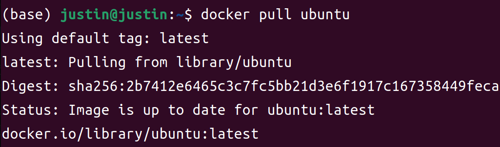
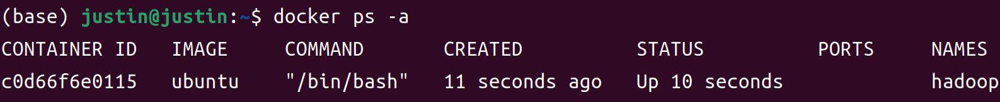
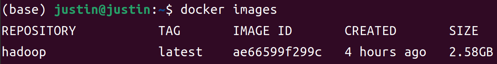
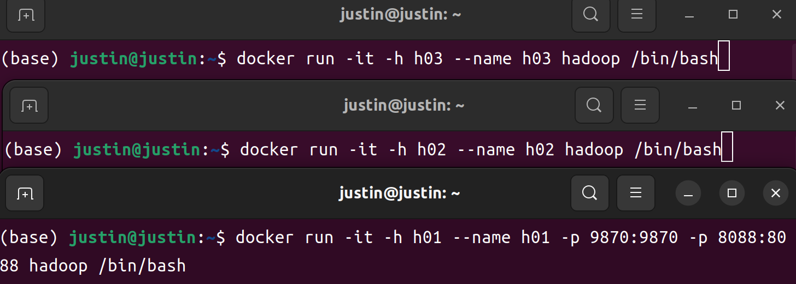
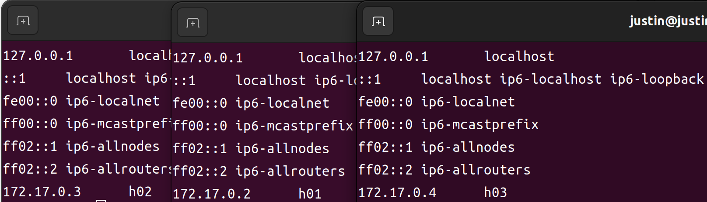
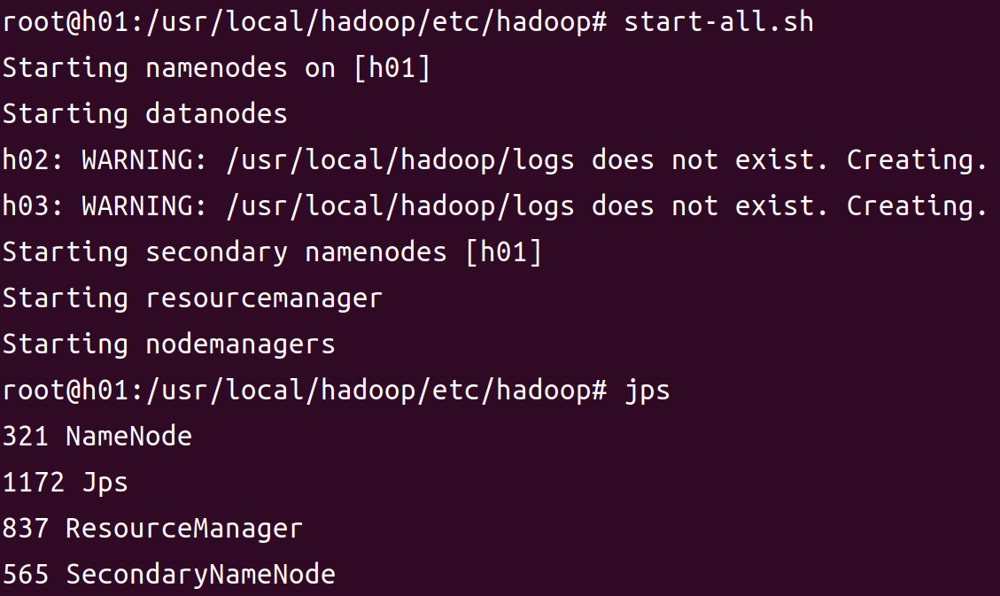
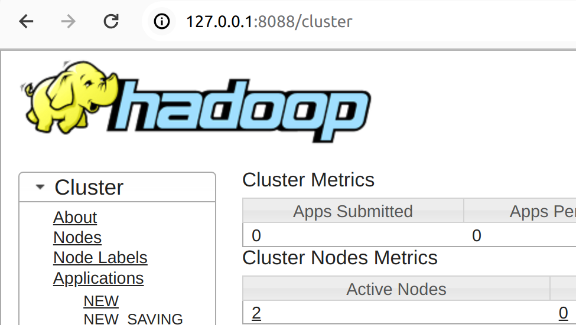
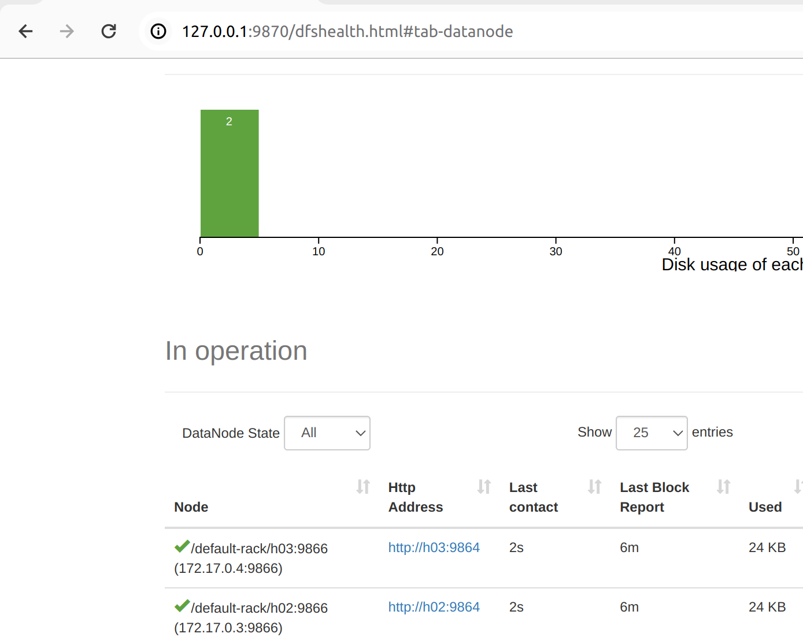
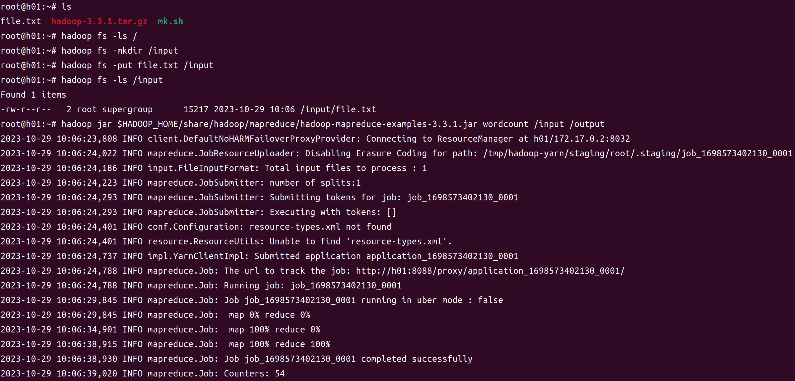
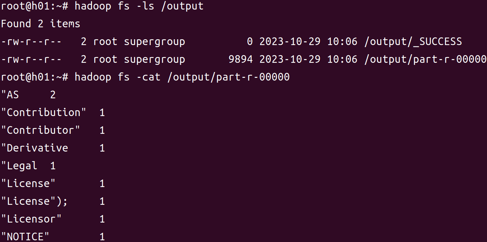

# Docker 部署Hadoop集群

#### 1.安装Docker

#### 2.制作Hadoop镜像

+ 拉取ubuntu的镜像
  ```latex
  docker pull ubuntu # 拉取基础镜像
  ```

  

+ 进入镜像

  ```latex
  docker run -it --name hadoop ubuntu /bin/bash 
  # -i 交互式 -t 分配伪终端,tty,--name 名称
  ```

  

  安装必要软件

  ```latex
  # 换源
  sed -i s@/archive.ubuntu.com/@/mirrors.aliyun.com/@g /etc/apt/sources.list
  sed -i s@/security.ubuntu.com/@/mirrors.aliyun.com/@g /etc/apt/sources.list
  apt-get clean
  apt-get update
  # 下载java
  apt update
  apt install openjdk-8-jdk
  java -version  
  update-alternatives --config java  # 查看安装路径
  # 安装必要工具
  apt install vim net-tools 
  apt-get install openssh-server openssh-client
  cd
  ssh-keygen -t rsa -P '' -f ~/.ssh/id_rsa
  cat .ssh/id_rsa.pub >> .ssh/authorized_keys
  echo "service ssh start" >> ~/.bashrc
  echo "source /etc/profile" >> ~/.bashrc
  source .bashrc
  ```

+ 下载hadoop
  ```latex
  cd
  wget https://mirrors.tuna.tsinghua.edu.cn/apache/hadoop/common/hadoop-3.3.1/hadoop-3.3.1.tar.gz
  tar -zxvf hadoop-3.3.1.tar.gz -C /usr/local
  cd /usr/local
  mv hadoop-3.3.1 hadoop
  #创建所需文件夹
  mkdir -p /data/hadoop/tmp
  mkdir -p /data/hadoop/hdfs
  mkdir -p /data/hadoop/hdfs/name
  mkdir -p /data/hadoop/hdfs/data
  ```

+ 配置环境变量

  ```latex
  vim /etc/profile
  添加以下内容
  #java
  export JAVA_HOME=/usr/lib/jvm/java-8-openjdk-amd64
  export JRE_HOME=${JAVA_HOME}/jre  
  export CLASSPATH=.:${JAVA_HOME}/lib:${JRE_HOME}/lib    
  export PATH=${JAVA_HOME}/bin:$PATH
  #hadoop
  export HADOOP_HOME=/usr/local/hadoop
  export PATH=$PATH:$HADOOP_HOME/bin:$HADOOP_HOME/sbin
  export HADOOP_COMMON_HOME=$HADOOP_HOME 
  export HADOOP_HDFS_HOME=$HADOOP_HOME 
  export HADOOP_MAPRED_HOME=$HADOOP_HOME
  export HADOOP_YARN_HOME=$HADOOP_HOME 
  export HADOOP_INSTALL=$HADOOP_HOME 
  export HADOOP_COMMON_LIB_NATIVE_DIR=$HADOOP_HOME/lib/native 
  export HADOOP_CONF_DIR=$HADOOP_HOME 
  export HADOOP_LIBEXEC_DIR=$HADOOP_HOME/libexec 
  export JAVA_LIBRARY_PATH=$HADOOP_HOME/lib/native:$JAVA_LIBRARY_PATH
  export HADOOP_CONF_DIR=$HADOOP_HOME/etc/hadoop
  export HDFS_DATANODE_USER=root
  export HDFS_DATANODE_SECURE_USER=root
  export HDFS_SECONDARYNAMENODE_USER=root
  export HDFS_NAMENODE_USER=root
  export YARN_RESOURCEMANAGER_USER=root
  export YARN_NODEMANAGER_USER=root
  ```

+ hadoop配置文件修改

  cd $HADOOP_CONF_DIR

  + ```latex
    vim hadoop-env.sh
    添加以下内容
    export JAVA_HOME=/usr/lib/jvm/java-8-openjdk-amd64
    export HDFS_NAMENODE_USER=root
    export HDFS_DATANODE_USER=root
    export HDFS_SECONDARYNAMENODE_USER=root
    export YARN_RESOURCEMANAGER_USER=root
    export YARN_NODEMANAGER_USER=root
    ```

  + ```latex
    vim core-site.xml
    添加以下内容
    <configuration>
        <property>
            <name>fs.default.name</name>
            <value>hdfs://h01:9000</value>
        </property>
        <property>
            <name>hadoop.tmp.dir</name>
            <value>/data/hadoop/tmp</value>
        </property>
    </configuration>
    ```

  + ```latex
    vim hdfs-site.xml
    添加以下内容
    <configuration>
        <property>
            <name>dfs.replication</name>
            <value>2</value>
        </property>
        <property>
            <name>dfs.namenode.name.dir</name>
            <value>/data/hadoop/hdfs/name</value>
        </property>
        <property>
            <name>dfs.namenode.data.dir</name>
            <value>/data/hadoop/hdfs/data</value>
        </property>
    </configuration>
    ```

  + ```latex
    vim mapred-site.xml
    添加以下内容
    <configuration>
        <property>
            <name>mapreduce.framework.name</name>
            <value>yarn</value>
        </property>
        <property>
            <name>mapreduce.application.classpath</name>
            <value>
                /usr/local/hadoop/etc/hadoop,
                /usr/local/hadoop/share/hadoop/common/*,
                /usr/local/hadoop/share/hadoop/common/lib/*,
                /usr/local/hadoop/share/hadoop/hdfs/*,
                /usr/local/hadoop/share/hadoop/hdfs/lib/*,
                /usr/local/hadoop/share/hadoop/mapreduce/*,
                /usr/local/hadoop/share/hadoop/mapreduce/lib/*,
                /usr/local/hadoop/share/hadoop/yarn/*,
                /usr/local/hadoop/share/hadoop/yarn/lib/*
            </value>
        </property>
    </configuration>
    ```

  + ```latex
    vim yarn.site.xml
    添加以下内容
    <configuration>
        <property>
            <name>yarn.resourcemanager.hostname</name>
            <value>h01</value>
        </property>
        <property>
            <name>yarn.nodemanager.aux-services</name>
            <value>mapreduce_shuffle</value>
        </property>
    </configuration>
    ```

  + ```latex
    #在新的终端中查看当前容器ID
    docker ps -a  # 找到当前容器id
    docker commit -m "config hadoop" 容器ID hadoop
    #制作完成的镜像大概2.58G
    ```

    

#### 3.配置

```latex
#同时打开三个终端分别运行如下密令
docker run -it -h h01 --name h01 -p 9870:9870 -p 8088:8088 hd /bin/bash
docker run -it -h h02 --name h02 hd /bin/bash
docker run -it -h h03 --name h03 hd /bin/bash
#docker run -it -h h04 --name h04 hadoop /bin/bash
#docker run -it -h h05 --name h05 hadoop /bin/bash
```



```latex
# 查看三个运行环境下的ip和主机名
cat /etc/hosts
vim /etc/hosts 将三个容器中的ip和主机名改成如下形式，注意三个都要！！！
172.17.0.2	h01
172.17.0.3	h02
172.17.0.4	h03

```



```latex
cd $HADOOP_CONF_DIR/
vim workers
将原来的localhost 改为h02,h03

#尝试使用h01,ssh连接h02,h03
ssh h02 # 回车后会提示，输入yes
exit # 连接成功后退出h02
ssh h03 # 输入yes
exit # 退出h03

#在h01中
hdfs namenode -format
# 启动集群
start-all.sh
jps
```



```latex
或者使用浏览器访问本地的9870和8088端口
```

| 127.0.0.1:8088                                               | 127.0.0.1:9870                                               |
| ------------------------------------------------------------ | ------------------------------------------------------------ |
|  |  |

#### 4.测试

```latex
cd
cat $HADOOP_HOME/LICENSE.txt > file.txt
hadoop fs -ls /
hadoop fs -mkdir /input
hadoop fs -put file.txt /input
hadoop fs -ls /input
hadoop jar $HADOOP_HOME/share/hadoop/mapreduce/hadoop-mapreduce-examples-3.3.1.jar wordcount /input /output
查看输出：
hadoop fs -ls /output
Found 2 items
-rw-r--r--   2 root supergroup          0 2020-04-07 12:34 /output/_SUCCESS
-rw-r--r--   2 root supergroup      35324 2020-04-07 12:34 /output/part-r-00000
hadoop fs -cat /output/part-r-00000
```





#### 5.docker vs vm

+ vm启动三台机器什么都不运行


+ docker run 三台容器

https://www.modb.pro/db/395327

[参考](https://blog.csdn.net/weixin_42037651/article/details/125483218)

