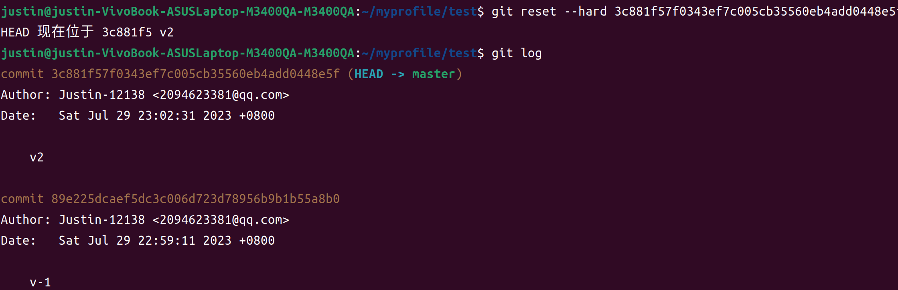
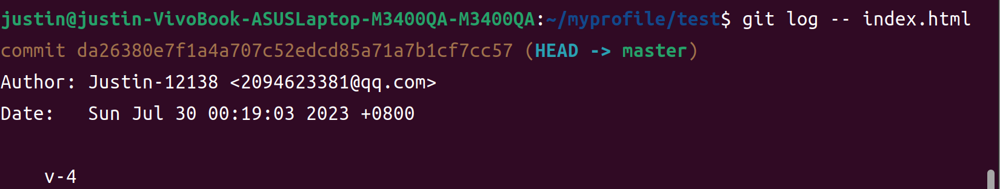
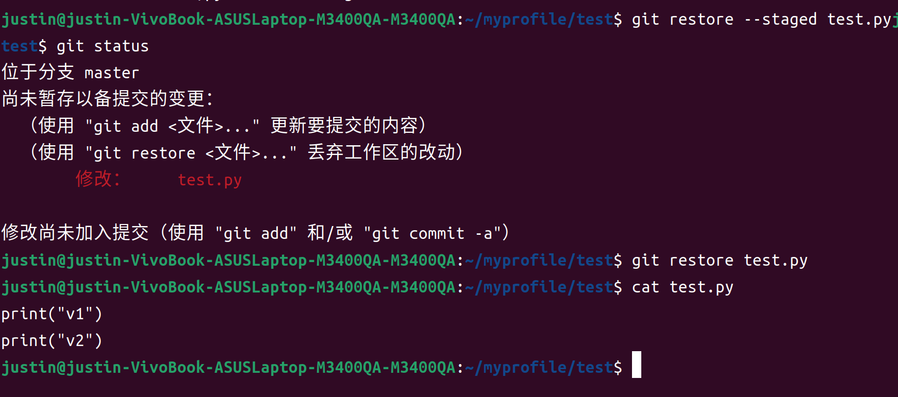

# Usage of Git

#### 0:写在前面

:page_with_curl:其实git很好上手,最好的教程其实是官网的教程[git官网](https://git-scm.com/book/zh/v2)
:open_book: 需要会一些简单的操作与配置即可解锁版本控制的快乐和GitHub托管代码带来的便捷
:pager: 以及很多Github的玩法，比如个人博客:notebook:
:exclamation:本人的此份笔记是于2023年八月中旬所写，后因开学去学校了，中途并未写出一个完整的教程，最终于2023年9.25完成此份笔记。

#### 0-1关于什么是Git？

我所理解的git就是一个版本控制系统，更好的去管理我们的项目，
:label:在我们的项目中:file_folder:,我们常常会遇到如下情况

 1. 我们的对我们的文件进行修改的过程中遇到一个相对重要的改动

    ```c++
    //例如我们的test.py
    #include<iostream>
    using namespace std;
    
    int main(){
    	int a,b,c;
        a=100;
        b=200;
        c=300;
        cout<<"这是我的当前文件"<<endl;
    //假设此时你准备做一些改动，但是又想保存当前项目文件的状态，防止你改到后面忘记了之前的一些定义，等等
    	//op1=
    	//op2=
    	//op3=
    //此时常规操作就是另存一份文件副本，命名为test_backup.py,继续在原test.py上修改。
        
    /*
    如果你使用Git来管理，那么将会变得简单，快捷。
    我们只需要在当前状态下创建一个版本即可
    eg: 
    git add test.py
    git commit -m 'before_you_edit'
    git log test.py
    上述三个操作即可为我们在当前状态创建一个版本，并查看我们所创建的版本。
    我们可以继续在此文件上进行编辑，git可以不断地在我们需要的时候创建版本，并在需要的时候回退到指定的版本。
    让我们更加方便快捷的管理我们的项目文件。
    */
    return 0;
    }
    ```


#### 1.版本创建

```markdown
mkdir test #创建文件夹
cd test #进入test
git init #初始化
```


```markdown
ls -al # 出现.git
```


```markdown
touch readme.md #创建一个测试文件
sudo vi readme.md #编辑测试文件
cat readme.md #查看测试文件
git add readme.md #跟踪测试文件
git commit -m 'v1' #提交测试文件，说明信息为v1
git log #查看git日志
```


```markdown
sudo vi readme.md #再次编辑测试文件
git add readme.md #跟踪测试文件
cat readme.md #查看测试文件
git commit -m 'v2' #提交测试文件，描述为v2
git log #查看git日志,commit后面的一长串数字是版本编号，可用于指定版本
```


#### 2.版本回退

每次被跟踪文件被修改，并提交就会有：

```markdown
#表达方法-1
HEAD #最新版本
HEAD^ #前一个版本
HEAD^^ #前两个版本
.
.
.
以此类推
#表达方法-2
HEAD #最新版本
HEAD~1 #前1个版本
HEAD~2 #前2个版本
HEAD~3 #前3个版本
.
.
.
HEAD~n #前n个版本
```

```markdown
git reset --hard HEAD^ #回退到前一个版本
git log #查看日志
```


我们现在如果需要回到版本2，则需要使用commit的版本编号来进行制定版本

```markdown
git reset --hard 3c881f57f0343ef7c005cb35560eb4add0448e5f #你自己的编号，其实可以不用完全复制，复制前面一部分即可
git reset --hard 3c881f57f0343e
git log #查看日志
cat readme.md #查看文件
```




倘若你不小心关闭了终端或者你不想往上翻找记录，可使用

```markdown
git reflog #查看各个版本的编号
git reset --hard +版本编号 #回到指定版本
```


#### 3.git 工作区和版本库

**工作区**：我们git init所在的文件夹，在本文中，**/home/justin/myprofile/test** 即是工作区，我们可在此区域编辑我们的项目。

**版本库**：工作区有一个隐藏的文件目录 .git 这个即是git 的版本库，里面存放有许多文件,其中比较重要的就是index（暂存区）

还有git为我们创建的第一个分支master，以及指向master的第一个指针叫较HEAD。


暂存区简单理解：

工作区：有readme.md文件

使用 git add readme.md 会将文件放入版本库的暂存区

使用 git commit -m 'v-n' 会将文件放入到master的版本之下

倘若直接对文件进行修改

```markdown
touch index.html
sudo vi index.html
"
<!DOCTYPE html>
<html lang="en">
<head>
    <meta charset="UTF-8">
    <title></title>
</head>
<body>
</body>
</html>
"
cat index.html
git status #查看跟踪及修改状态
```


在上述图片中，我们可以看到，我们创建了新的文件index.html，但是未跟踪，即未将其放入暂存区，

我们修改了之前跟踪的readme.md，但是未commit,git status查看状态会作出提醒。

```markdown
git add index.html #跟踪index.html
git status #查看状态
git commit -m 'v4' #提交到分支
git log #查看日志
```


```markdown
git log -- index.html #单独查看index.html的提交记录
```


**某文件单独回退**，目前，我们的readme.md有4个版本，但是index.html只有一个版本，如果我们使用：

```markdown
git rest --hard + 编号 #例如我们回到v2，那时候还没有index.html
```


我们可以看到，此时已经没有index.html的记录

```markdown
git reflog #查看所有记录
git reset --hard +编号 #回到我们有html.index记录的版本
```



```markdown
git rest 编号 readme.md #将单个文件回退到某个版本
git commit -m 'description' #提交记录
git checkout readme.md #更新到工作目录
cat readme.md
git log index.html
git log readme.md 
```


#### 4.管理修改

git管理文件的修改，**它只会提交暂存区的修改来创建版本**

```markdown
touch test.py #创建一个test文件
sudo vi test.py #编辑
"
print("v1")
"
cat test.py #查看
git add test.py #跟踪
git commit -m 'v1'#提交
git log test.py#查看日志
```


我们现在修改test.py,然后不将其放入暂存区域，直接commit

```markdown
echo 'print("v2")' >> test.py
cat test.py
git log test.py
git status
git commit -m 'v2'
git log test.py
```


此时我们可以看到，我们直接commit会提示我们修改尚未暂存，而git只会管理暂存区的修改，所以便不会v2的日志,此时，我们将其放入暂存区

```markdown
git status
git add test.py
git status
git commit- m 'v2'
git log - test.py
```


简单总结就是如果你希望你的修改保存为一个版本，在你每次修改完成之后就要将文件放入暂存区 git add test.py，然后commit -m 'description' 

**撤销修改**:

**工作区修改撤销**

```markdown
git status
echo 'print("v3")'
cat test.py
git status
git restore test.py #撤销工作区的修改
cat test.py 
git status
```


**暂存区修改撤销**+**工作区修改**

```markdown
git status
echo 'print("v3")' >> test.py & cat test.py
git status
git add test.py
git status
git restore --staged test.py #撤销暂存区修改
git status
git restore test.py #撤销工作区的修改
cat test.py
```




倘若已经提交了版本记录，那你就可以参考版本回退进行操作

```markdown
git log test.py
git rest 编号 test.py #将单个文件回退到某个版本
git commit -m '回退到某版本' #提交记录
git checkout test.py #更新到工作目录
cat test.py
git log test.py
git status
```

**对比工作区的修改和之前提交的版本有什么不同**

```markdown
echo 'print("test line")' & cat test.py
git diff HEAD -- test.py #对比工作区与最新的提交的HEAD之间的区别
git diff HEAD^ -- test.py #对比工作区与最新的提交的前一个版本之间的区别
```


```markdown
---代表的是HEAD版本里面的test.py
+++代表的是工作区的test.py
```

比较两个版本之间的不同

```markdown
git diff HEAD HEAD^ test.py
显示：
"
diff --git a/test.py b/test.py
index 1aa08bd..c471b2f 100644
--- a/test.py
+++ b/test.py
@@ -1,2 +1 @@
 print("v1")
-print("v2")
"
代表HEAD和HEAD^相比,HEAD要-print("v2")
git diff HEAD^ HEAD test.py
"
diff --git a/test.py b/test.py
index c471b2f..1aa08bd 100644
--- a/test.py
+++ b/test.py
@@ -1 +1,2 @@
 print("v1")
+print("v2")
"
代表HEAD^和HEAD相比,HEAD^要+print("v2")
```


**删除文件**

```markdown
rm test.py
ls
git status
git restore test.py #撤销删除
ls
git status
```


**分支管理**

本人对分支的理解在与项目上：一个项目由很多人完成，每个人在公司给定的项目下(一个初始吸纳更亩里面有一些基础的东西，比如之前的项目的内容，我们要在该项目基础上开发出新的功能)创建属于自己的分支，

```markdown
git branch #查看分支
git branch branch_name #创建分支
git checkout -b branch_name #创建并进入分支
git checkout branch_name #切换分支
git merge branch_name #合并分支

```


merge冲突，当我在两个不同的分支对同一个文件进行修改提交，然后将两个分支进行合并时，会发生冲突


修改冲突合并，需commit 一个新的版本记录，合并之后就会创建该版本记录.


没有冲突，dev分支创建文件，master分支merge文件


```markdown
nano编辑器保存
1.如果你要保存所做的修改,按下Ctrl+O。

2.想要退出,按下Ctrl+X。

3.如果你退出前没有保存所做的修改,它会提示你是否要保存;如果不要,请按N,反之,则按Y;然后它会让你确认要保存的文件名,确认或修改后按Enter即可。

```


