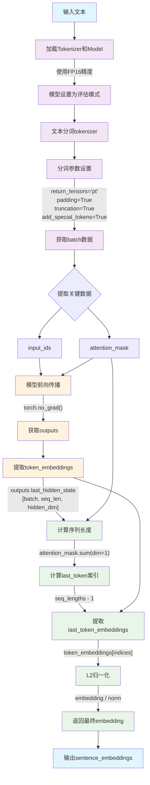
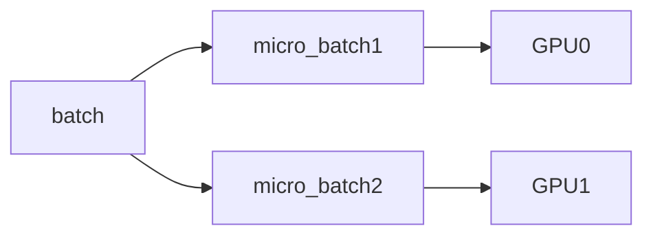

# LLM inference_review
### Basical-info

+ bit&byte

8bit=1byte

```latex
1bit = 1
1bit = 0
1byte = 00000000
1byte = 11111111
```

+ 显卡带宽的与位宽

$$
Bandwidth=\frac{BUSwidth}{8}*MemoryClockSpeed
$$


```latex
5090
Bandwith:1.79 TB/s
Memory Clock=1750 MHz=28 Gbps effective
BUS-WIDTH=512 bit
```

$$
Band=\frac{512}{8}*28
$$


+ 
+ 
+ 


#### Embedding



#### prefill&decode


| Inference Stage | Characteristics                                   | Bottleneck        |
| --------------- | ------------------------------------------------- | ----------------- |
| **Prefill**     | Full prompt processed in parallel, heavy GEMM ops | **Compute-bound** |
| **Decode**      | Token-by-token, KV cache reuse, matrix-vector ops | **Memory-bound**  |


$$
\text{KV\_cache\_bytes} 
= 2 \times L \times H_{\mathrm{kv}} \times S \times D_{\mathrm{head}} \times B_{\mathrm{elem}}
$$

其中：

+ 系数 \( 2 \) 表示 key 和 value 各占一份  

- \( L \)：层数（Number of hidden layers）  24
- \( S \)：序列长度（Sequence length）  14
- \( H_kv \)：Key-Value 头数（Number of KV heads）2  
- \( D_head \)：Head 维度（Hidden size / Attention heads）  896/14=64
- \( B_elem} \)：每元素字节数（bytes per element）  4

代入 Qwen/Qwen2.5-0.5B 参数：
$$
\text{KV\_cache\_bytes}
= 2 \times 24 \times 14 \times 2 \times 64 \times 4
$$

```latex
Calculation Details:
Selected Model: Qwen/Qwen2.5-0.5B
Hidden Size: 896
Number of Attention Heads: 14
Number of Hidden Layers: 24
Number of Key-Value Heads: 2
Head Size: 64 (Hidden Size / Attention Heads)
Data Type Size: 4 bytes
Total Elements: 2 × 24 × 14 × 2 × 64 = 86016
Total Bytes: 86016 × 4 = 344064 bytes
KV Cache Size: 344064 / (1024³) = 0.000328125 GB

......
Layer 22:
  Key   shape: (1, 2, 14, 64), dtype: torch.float32, elems: 1792, size: 7.00 KB
  Value shape: (1, 2, 14, 64), dtype: torch.float32, elems: 1792, size: 7.00 KB
Layer 23:
  Key   shape: (1, 2, 14, 64), dtype: torch.float32, elems: 1792, size: 7.00 KB
  Value shape: (1, 2, 14, 64), dtype: torch.float32, elems: 1792, size: 7.00 KB
============================================================
Total KV cache size: 0.3281 MB
============================================================
```

```latex
# 2并发,536长度,Qwen2.5-0.5B
......
Layer 22:
  Key   shape: (2, 2, 2156, 64), dtype: torch.float32, elems: 551936, size: 2156.00 KB
  Value shape: (2, 2, 2156, 64), dtype: torch.float32, elems: 551936, size: 2156.00 KB
Layer 23:
  Key   shape: (2, 2, 2156, 64), dtype: torch.float32, elems: 551936, size: 2156.00 KB
  Value shape: (2, 2, 2156, 64), dtype: torch.float32, elems: 551936, size: 2156.00 KB
============================================================
Total KV cache size: 101.0625 MB
============================================================
import datetime
# 模型加载完成时间
model_load_time = datetime.datetime(2025, 8, 12, 23, 53, 34, 775557)
# 第一个token logits产生时间
first_token_time = datetime.datetime(2025, 8, 12, 23, 53, 53, 906365)

# 计算时间差（大约为prefill时间(不包含softmax,采样（贪心或随机）、解码（查embedding、转token）)）
prefill_duration = first_token_time - model_load_time
19.130808s
```


#### PD-Disaggregated

```latex
Why does PD matter?
Without PD: New requests preempt ongoing decoding, leading to high tail latencies for long-form completions.
With PD: Decoders are dedicated to generating tokens, leading to smooth, uninterrupted streaming.
PD is now adopted in several production-grade inference engines and internal deployments at top-tier AI platforms.
```

GPU0prefiller,GPU1decoder


### Lmcache

```latex
export CUDA_VISIBLE_DEVICES=0
nohup vllm serve /mnt/llm/models/database/Qwen3-0.6B --trust_remote_code \
--dtype auto --served-model-name qwen3-0.6b \
--host 0.0.0.0 --port 6690 --gpu_memory_utilization 0.9 \
--max-model-len 16384 --tensor-parallel-size 2  >> qwen3.out &

export LMCACHE_CONFIG_FILE="/mnt/feisu/lmcache/backendcpu.yaml" 
export LMCACHE_USE_EXPERIMENTAL=True 

export CUDA_VISIBLE_DEVICES=7
vllm serve /home/lz/models/Qwen3-8B-FP8 --trust_remote_code \
--dtype auto --served-model-name Qwen3-8B-FP8 \
--host 0.0.0.0 --port 6699 --gpu_memory_utilization 0.9 \
--max-model-len 10240 --tensor-parallel-size 1 


--kv-transfer-config '{"kv_connector":"LMCacheConnectorV1","kv_role":"kv_both"}' >> gpt-oss.out &

vllm serve /home/lz/models/Qwen3-8B-FP8 --trust_remote_code --dtype auto --served-model-name Qwen3-8B-FP8 --host 0.0.0.0 --port 6699 --gpu_memory_utilization 0.9 --max-model-len 10240 --tensor-parallel-size 1 --uvicorn-log-level debug 
```


$$
\begin{array}{|c|c|c|}
\hline
\textbf{组件} & \textbf{说明} & \textbf{公式} \\
\hline
\text{权重 (Weights)} & 模型参数常驻显存 &
N_{\text{params}} \times \text{bytes\_per\_param} \\
\hline
\text{激活 (Activations)} & 前向/反向计算的临时 buffer &
\approx 1\sim2 \,\text{GiB (经验值)} \\
\hline
\text{CUDA Graph Buffers} & CUDA 图录制的额外开销 &
\approx 0.5\sim1 \,\text{GiB (经验值)} \\
\hline
\text{Non-Torch CUDA Buffers} & PyTorch 之外的 CUDA 内存 &
\approx 0.1\sim0.5 \,\text{GiB (经验值)} \\
\hline
\text{KV Cache} & 注意力 key/value 的缓存 &
N_{\text{layers}} \times N_{\text{heads}} \times d_{\text{head}} \times 2 \times L_{\text{seq}} \times B \times \text{bytes\_per\_element} \\
\hline
\end{array}
$$


### Distributed deployment

#### data parallel

Note that data parallelism is also a technique often mentioned in the same context as the others listed below. In this, weights of the model are copied over multiple devices, and the (global) batch size of inputs is sharded across each of the devices into microbatches. It reduces the overall execution time by processing larger batches. **However, it is a training time optimization that is less relevant during inference**.




#### tensor parallel

|                             MLP                              |                        self-attention                        |
| :----------------------------------------------------------: | :----------------------------------------------------------: |
|  |  |

```latex
1.5G	../Qwen3-0.6B/
(VllmWorker rank=0 pid=694621) INFO 08-14 11:33:20 [gpu_model_runner.py:1892] Model loading took 0.5670 GiB and 0.321561 seconds
(VllmWorker rank=1 pid=694622) INFO 08-14 11:33:20 [gpu_model_runner.py:1892] Model loading took 0.5670 GiB and 0.349024 seconds
embed_tokens.weight: 155582464
layers.0.self_attn.q_proj.weight: 2097152
layers.0.self_attn.k_proj.weight: 1048576
layers.0.self_attn.v_proj.weight: 1048576
layers.0.self_attn.o_proj.weight: 2097152
layers.0.self_attn.q_norm.weight: 128
layers.0.self_attn.k_norm.weight: 128
layers.0.mlp.gate_proj.weight: 3145728
layers.0.mlp.up_proj.weight: 3145728
layers.0.mlp.down_proj.weight: 3145728
layers.0.input_layernorm.weight: 1024
layers.0.post_attention_layernorm.weight: 1024
......
layers.27.self_attn.q_proj.weight: 2097152
layers.27.self_attn.k_proj.weight: 1048576
layers.27.self_attn.v_proj.weight: 1048576
layers.27.self_attn.o_proj.weight: 2097152
layers.27.self_attn.q_norm.weight: 128
layers.27.self_attn.k_norm.weight: 128
layers.27.mlp.gate_proj.weight: 3145728
layers.27.mlp.up_proj.weight: 3145728
layers.27.mlp.down_proj.weight: 3145728
layers.27.input_layernorm.weight: 1024
layers.27.post_attention_layernorm.weight: 1024
```


```latex
export CUDA_VISIBLE_DEVICES=4,5,6,7
export VLLM_LOGGING_LEVEL=DEBUG
export LMCACHE_CONFIG_FILE="/home/lz/models/lmcache.yaml" 
nohup vllm serve /home/lz/models/Qwen3-32B-FP8 --trust_remote_code --dtype auto \
--served-model-name Qwen3-8B-FP8 --host 0.0.0.0 --port 6001 --gpu_memory_utilization 0.8 \
--rope-scaling '{"rope_type":"yarn","factor":4.0,"original_max_position_embeddings":32768}' \
--max-model-len 51200 --tensor-parallel-size 4 --enable-auto-tool-choice \
--tool-call-parser hermes --chat-template /home/lz/models/vllm/examples/qwen3_nonthinking.jinja \
--kv-transfer-config '{"kv_connector":"LMCacheConnectorV1","kv_role":"kv_both"}' \
>> Qwen3-32B-FP8.out &

export CUDA_VISIBLE_DEVICES=4,5,6,7
export VLLM_LOGGING_LEVEL=DEBUG
nohup vllm serve /home/lz/models/Qwen3-8B-FP8 --trust_remote_code --dtype float16 --tensor-parallel-size 1 --max-model-len 1024 --gpu_memory_utilization 0.8 &

```


```latex
(EngineCore_DP0 pid=2552931) INFO 09-28 21:12:51 [v1/worker/gpu_model_runner.py:3118] Graph capturing finished in 7 secs, took 0.68 GiB


(EngineCore_DP0 pid=2552931) INFO 09-28 21:12:51 [v1/worker/gpu_worker.py:391] Free memory on device (23.08/23.53 GiB) on startup. Desired GPU memory utilization is (0.8, 18.82 GiB). 

Actual usage is 
8.8 GiB for weight, 
1.4 GiB for peak activation,
0.02 GiB for non-torch memory, and 
0.68 GiB for CUDAGraph memory. 

Current kv cache memory in use is 9232221491 bytes.
7.924

Replace gpu_memory_utilization config with `--kv-cache-memory=8347223347` to fit into requested memory, or `--kv-cache-memory=12923195904` to fully utilize gpu memory. Current kv cache memory in use is 9232221491 bytes.
20514MiB

(EngineCore_DP0 pid=2552931) DEBUG 09-28 21:12:43 [v1/worker/gpu_worker.py:284] Initial free memory: 23.08 GiB; Requested memory: 0.80 (util), 18.82 GiB

(EngineCore_DP0 pid=2552931) DEBUG 09-28 21:12:43 [v1/worker/gpu_worker.py:291] Free memory after profiling: 14.23 GiB (total), 9.97 GiB (within requested)

(EngineCore_DP0 pid=2552931) DEBUG 09-28 21:12:43 [v1/worker/gpu_worker.py:297] Memory profiling takes 14.40 seconds. Total non KV cache memory: 10.22GiB; torch peak memory increase: 1.40GiB; non-torch forward increase memory: 0.02GiB; weights memory: 8.80GiB.

(EngineCore_DP0 pid=2552931) INFO 09-28 21:12:43 [v1/worker/gpu_worker.py:298] Available KV cache memory: 8.60 GiB
(EngineCore_DP0 pid=2552931) INFO 09-28 21:12:44 [v1/core/kv_cache_utils.py:864] GPU KV cache size: 62,608 tokens
(EngineCore_DP0 pid=2552931) INFO 09-28 21:12:44 [v1/core/kv_cache_utils.py:868] Maximum concurrency for 1,024 tokens per request: 61.14x


```


#### pipeline parallel


#### expert parallel


### AI-memorywall


| Year | Largest/Example LLM                    | Parameters (Billion) | YoY Growth (Params)        | GPU Model             | FP16 Tensor TFLOPS | YoY Growth (TFLOPS) | Memory Bandwidth (TB/s) | YoY Growth (Bandwidth) |
| ---- | -------------------------------------- | -------------------- | -------------------------- | --------------------- | ------------------ | ------------------- | ----------------------- | ---------------------- |
| 2020 | GPT-3 (OpenAI)                         | 175                  | -                          | A100                  | 312                | -                   | 2.0                     | -                      |
| 2021 | Megatron-Turing NLG (Microsoft/NVIDIA) | 530                  | 3.0x                       | A100 (no new release) | 312                | 1.0x                | 2.0                     | 1.0x                   |
| 2022 | PaLM (Google)                          | 540                  | 1.0x                       | H100                  | 990                | 3.2x                | 3.35                    | 1.7x                   |
| 2023 | GPT-4 (OpenAI, rumored)                | ~1760                | 3.3x                       | H100 (no new release) | 990                | 1.0x                | 3.35                    | 1.0x                   |
| 2024 | DeepSeek-V3 (DeepSeek)                 | 671                  | 0.4x (shift to efficiency) | H200                  | 990                | 1.0x                | 4.8                     | 1.4x                   |
| 2025 | DeepSeek R1 (DeepSeek)                 | 671                  | 1.0x                       | B200                  | 2250               | 2.3x                | 8.0                     | 1.7x                   |
| 2025 | Kimi-K2                                | 1000                 | 1.49x                      | B200                  | 2250               | 1.0x                | 1.0                     | 1.0x                   |

