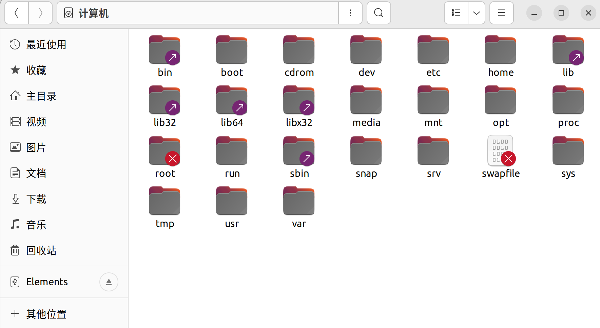
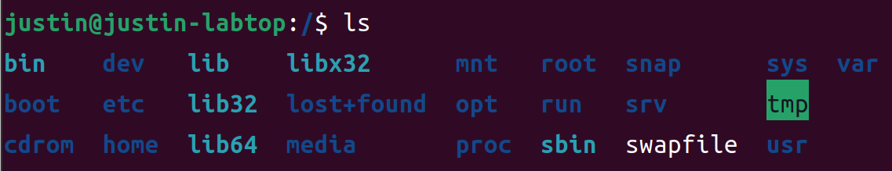
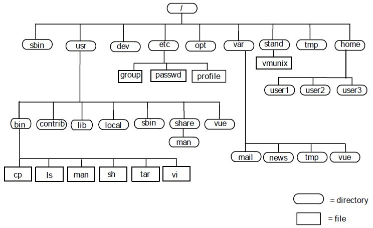

# GNU/LINUX

## 1.写在前面

:100:: 这是本人于2023.08.01在bilibil开始学习Linux操作系统的学习笔记
:penguin:本人所用的操作系统:`uname -a`

```tex
Linux justin-labtop 6.2.0-26-generic #26~22.04.1-Ubuntu SMP PREEMPT_DYNAMIC Thu Jul 13 16:27:29 UTC 2 x86_64 x86_64 x86_64 GNU/Linux
```

:book::本人在学习课程之前对GNU/Linux操作的了解

- 操作系统的发展历史
  [Unix_to Gnu/Linux](https://www.bilibili.com/video/BV1Mv4y127wA/?spm_id_from=333.880.my_history.page.click&vd_source=233482ad6c5a629ccdd3bf05f2c6ed41 "Unix to Gnu/Linux") :exclamation::(强烈推荐观看！)

- 会一些简单操作密令<br>

  ```tex
  ls # 列出当前目录下的文件
  cd # 进入某文件夹
  sudo apt-get update && sudo apt-get upgrade 
  ......
  ```

- 安装过的软件及服务

  - Hadoop+Spark(大数据课程所学)
  - Nginx(个人网站，但是服务器太贵，还是白嫖github吧)
    我的:spider_web:: [My web](https://justin-12138.github.io/ "Justin")
  - Mysql(数据库系统所学)
  - Genshin Impact Launch！(自学)
    1. 安装wine
    2. 安装vulkan
    3. 安装dxvk
    4. 打补丁
    5. 原神！启动！
    6. ......已经退坑！(深渊已满星，出过双金!)
  - ......还有些忘记了

- 为什么学习Linux:heart:

  - 刚开始是想深度学习加速，但是后面才发现还是需要特定的卡才能加速
  - 入坑之后折腾了很多服务端:computer:的东西，数据库，nginx，但是都是浅尝辄止
  - Linux总给我一种很优雅的，很干净的感觉，而且很稳定(哈哈哈):star2:
  - 技多不压身～！:skier:主要是还想从事运维的一些工作，不想卷开发!!!:cactus:

## 2.Linux简介以及如何安装Linux

:one::Linux 还是 GNU/Linux？

- 关于这个问题可以去观看一个视频，讲了从mutics到Linux的很长一段历史,很有意义！

  [Unix_to Gnu/Linux](https://www.bilibili.com/video/BV1Mv4y127wA/?spm_id_from=333.880.my_history.page.click&vd_source=233482ad6c5a629ccdd3bf05f2c6ed41 "Unix to Gnu/Linux") :heart_decoration:

:two::如何安装Linux
在Linux中学习Linux！

- 虚拟机

  常用的的虚拟机软件有[VirtualBox](https://www.virtualbox.org/wiki/Downloads)，VMWare
  本教程的安装使用VirtualBox演示，如有需要，小伙伴们也可以根据网上教程使用VMWare安装。

  1. 下载并安装virtualbox
     我这边使用的是https://www.virtualbox.org/wiki/Download_Old_Builds_6_1

     ​         6.1.40（教程使用为：windows hosts），小伙伴们可以根据自己的操作系统进行选择。
     

     双击下载完成的.exe安装:


1. 下载Ubuntu iso文件
   本人学习过程中使用的为ubuntu 18.04
   大家可以根据自己的需要安装不通的版本

[ubuntu阿里云](http://mirrors.aliyun.com/oldubuntu-releases/releases/?spm=a2c6h.25603864.0.0.5ee66f0fOBy7kn "Ubuntu阿里云镜像源")


点击新建：并配置文件所在目录
名称：自己取（英文）
文件夹：选择有足够空间的文件夹
类型：Linux
版本Ubuntu64位


内存大小一般可设置为3G或者4G


后面的操作基本就是下一步：


下一步


:warning::动态分配！


一般设置为20G，基本够用了


启动！


选择一个虚拟光盘文件


选择下载好的iso文件


选择


启动！


中文简体+安装ubuntu


汉语


最小安装！


现在安装


继续


设置位置时区


创建用户密码


等待安装


安装完成，重启！


输入密码登录账户


不升级

稍后提醒


鼠标右键打开终端或者ctrl+alt+t


输入`uname -a`,即可看到我们的版本信息


设备:soon::安装增强功能


运行！


按下回车


此处提示我们需要安装gcc make perl
于是我们在终端中输入如下命令，并按下回车

```markdown
sudo apt-get update
sudo apt-get install gcc make perl
```


双击桌面的光盘图标文件，点击运行软件


打开终端输入`reboot` 重启


此时我们便可以调整我们的窗口大小


设置共享粘贴板双向


ok，我们的Ubuntu18.04在VirtualBox的安装就算完成啦！


- **双系统win基础安装ubuntu**
  

  0. 在已有的windows下去安装Linux，操作也很简单，Ubuntu安装基本也是下一步，下一步......

  我的双系统如下，本着认真负责的态度，我再给大家介绍一下如何在windows的基础上去安装ubuntu22.04Lts
  

  使用DiskGenius删除我原来的Ubuntu22.04lts，右键开始找到磁盘管理，自行准备大概100G或者150G或者根据你自己的需求进行划分，我这里就是用我未分配的空间（未分配需要你自己从原来的磁盘压缩，），网上大多数都是100G，大家可自行斟酌。

  

  emmm还是说一下分盘的一些常识：
  从左往右:C,D,我们买来的新电脑经常会由厂商帮助我们分好盘，不过现在大家动不动就是1t，正常使用的情况，根本不用担心C盘爆满，而且盘符的读写速度会随着你从左往右下降，C盘的读写速度是最快的，但是一般来说感知不明显，但是你玩一些大型游戏放在移动硬盘和C盘应该就会有明显的感觉。<br>

  再次秉着认真负责的态度，我在这里再向大家展示如何去分盘(先把未分配的区域扩展到D盘)
  :exclamation:注意扩展只能相邻扩展，不能跨盘符扩展，比如我上面的156.57GB就不能直接扩展到C盘，只能扩展到D盘。


将之前的未分配区域扩展到D盘


右键D盘，点击压缩卷，


我们在这里压缩1024 x 150 = 153600MB，点击压缩


压缩完成：


1. 制作启动盘

   一个大小8G以上的U盘，16，32都行
   使用工具：[Rufus](https://rufus.ie/zh/)

   

   先将空U盘插入电脑，Rufus下载完成后，直接双击启动镜像文件可以选择你下载好的镜像文件，我建议你使用22.04lts
   [Ubuntu22.04Lts](http://mirrors.aliyun.com/oldubuntu-releases/releases/22.04.1/?spm=a2c6h.25603864.0.0.41457ff3wmSZVM "ubuntu22.04")(阿里云下载)
   


文件系统选择默认即可。然后点击开始，下面进度条显示完成之后我们就完成了启动盘的制作。


1. 

   

2. 

   

   

3. 

   

   

4. 

   

   

5. 

   

   

   

6. 
7. 
8. 


- 纯Linux

  

:three::

:four::


## 3.linux的目录结构

0. GUI和命令行

    - :computer::GUI（Graphics User Interface）图形用户界面
      简言之：就是你可以看到可视化的窗口，直观，如树形结构中的🌰

    - :scroll:CUI（Character user interface）字符用户界面
      简言之：就是你只有一个命令行，用多了也直观，如树形结构中的🌰

    - |    对比属性    |            GUI             |        CUI         |
      | :------------: | :------------------------: | :----------------: |
      |      交互      |    使用图形(图像、图标)    |  使用命令(仅文本)  |
      |      导航      |            容易            |        困难        |
      | 使用的外围设备 | 键盘和鼠标(或任何指点设备) |       仅键盘       |
      |      精度      |             低             |         高         |
      |      速度      |             低             |         高         |
      |    操作简单    |            简单            | 困难，需要专业知识 |
      |    所需内存    |             高             |         低         |
      |     灵活性     |           更灵活           |      一般灵活      |
      |   自定义外观   |        高度可自定义        |    外观无法更改    |

    Table source:[GUI&CUI](https://geek-docs.com/operating-system/os-ask-answer/whats-the-difference-between-gui-and-cui.html "GUI&CUI")
    🌰：
    GUI::framed_picture:
    

    CUI::black_medium_square:
    

    

1. **树形结构**

   可以看出我们的文件目录结构是一个”所谓“的树形结构
   即一个根目录`/`，然后根目录里面有子目录

   `usr`,`dev`,`opt`......

   :question::当你看到这里的时候，可能会有一些不知所措，这里面的文件都是什么？

   [](https://cn.bing.com/images/search?view=detailV2&ccid=MG44P%2FUt&id=817701BE773A33A08EDE45C4830641F9B52A5538&thid=OIP-C.MG44P_Ut1K8z-DKuB40FbAHaEi&mediaurl=https%3A%2F%2Fts1.cn.mm.bing.net%2Fth%2Fid%2FR-C.306e383ff52dd4af33f832ae078d056c%3Frik%3DOFUqtflBBoPERQ%26riu%3Dhttp%253a%252f%252fstatic.oschina.net%252fuploads%252fimg%252f201407%252f13012401_WCtc.jpg%26ehk%3Df3lvuFPzO%252bSFhgi80TapEZJswe4Sa6fKA99Jb6X3n0w%253d%26risl%3D%26pid%3DImgRaw%26r%3D0&exph=456&expw=744&q=linux%e6%96%87%e4%bb%b6%e7%bb%93%e6%9e%84&simid=608024978603727909&form=IRPRST&ck=F537326F3CF646384A4E26BBBA15E120&selectedindex=3&ajaxhist=0&ajaxserp=0&vt=0&sim=11 "filestruct")

   

   :memo::作为一个学习过的人来说，这些文件对刚开始来说了解的意义并不是特别重要<br>:expressionless::如果你非要了解，可以上网搜索，或者后面的Linux目录介绍<br>

   :key::学习一项新东西的诀窍就是从简单到难，并且持之以恒！
   :ok_hand::话不多说，让我们开始CUI命令开始愉快学习吧！

## 4.terminal 命令简介

再次写在前面：
GNU/Linux是主要服务于服务器的的操作系统，一般来说是不太用于，生活，娱乐。
什么是服务器嘞，我的理解是，提供服务的机器叫服务器
多数情况来说它是一台电脑，一台性能，配置各方面都是非常顶级的电脑。
根据不同的应用场景呢，所在意的点也不一样，比如我们学院的服务器。
主要用于跑很多机器学习，深度学习，神经网络等的代码，
所以我们学院的某台服务器据说是配备了4张A100:star2:

emm，扯远了，服务器大致就是提供服务的机器，根据不同的应用场景，

提供不同的服务，比如加速，网站服务，app服务，等等

很多教程都是从一些简单的密令开始学习，我学习过程中没有什么特别大的问题。
但是在学习过程中，难免会忘记，所以学习一定要温故而知新，🆗

话不多说，那我们开始吧！

- ubuntu中使用`ctrl+alt+t`，打开终端，关于什么是终端呢，这个又跟计算机的历史发展存在联系
  大家可以看一下这位博主的视频，从历史的角度向我们展示了什么是[终端](https://www.bilibili.com/video/BV16A411675V/?spm_id_from=333.880.my_history.page.click)?
  在此处呢，我们所面临的终端界面就是我们之前所提及的CUI，用于输入密令的一个交互界面。在工作中绝大多数时间我们所接触的就是一个终端，或者远程的连接，操作也是一个简单的终端，纯字符操作，纯字符反馈。

- **命令的通用格式(组成)**
  
  `command [-options] [parameters]`
  `命令 [选项] [参数]`
  
  -options :[可选，非必填] 命令的一些选项，可通过选项来控股之命令细节
  
  -parameter :[可选，非必填]命令的参数，多用于命令的指向目标
  OK，相信很多小伙伴看到这里还是很懵逼，没关系大家接着往下看一个简单的命令的栗子:
  
  `ls`:(list directory contents)命令用于显示指定工作目录下之内容
  
  ls -l                    # 以长格式显示当前目录中的文件和目录
  ls -a                    # 显示当前目录中的所有文件和目录，包括隐藏文件
  ls -lh                   # 以人类可读的方式显示当前目录中的文件和目录大小
  ls -t                    # 按照修改时间排序显示当前目录中的文件和目录
  ls -R                    # 递归显示当前目录中的所有文件和子目录
  ls -l /etc/passwd        # 显示/etc/passwd文件的详细信息
  
- **内建密令**
  所谓 Shell 内建命令，就是由 Bash 自身提供的命令，而不是文件系统中的某个可执行文件。例如，用于进入或者切换目录的 `cd` 命令，虽然我们一直在使用它，但如果不加以注意很难意识到它与普通命令的性质是不一样的：该命令并不是某个外部文件，只要在 Shell 中你就一定可以运行这个命令。
  
  当在bash中键入一个命令时系统会先看他是否是一个内建命令，如果不是才会查看是否是系统命令或第三方工具。因为即不需要通过衍生出子进程来进行，也不需要打开程序文件，内建命令的执行速度要更快，效率也更高。
  
  例如 `cd` 和 `exit` 命令都是内建于 bash shell。可以利用 `type` 命令来查看某个命令是否是内建的]。比如 `echo` 和 `pwd` 既有内建命令也有外部命令。可以使用 `type -a` 来查看。
  
- 
  
  

  

  

## 5.Linux通用常用密令

​	再次写在前面，由于本教程纯属是个人的学习笔记，关于密令的学习顺序基本都是根据本人的实际情况来定制的

1. ```help``` command,显示某命令的相关信息。
   **意思是如果你想知道某个密令的用法，直接使用 ```help```+ command**
   例如:	help help
   			help cd

   ​			help grep
   ......	
   🌰

   ```latex
   julie@julie-VirtualBox:~$ help help
   help: help [-dms] [模式 ...]
   	%此处我们可以看到说help的
       显示内建命令的相关信息。
       
       显示内建命令的简略信息。如果指定了 PATTERN 模式，
       给出所有匹配 PATTERN 模式的命令的详细帮助，否则打
       印一个帮助主题列表
       %注意此处就是我们之前所提及的密令的通用格式：命令 [选项] [参数]
       选项：
         -d	输出每个主题的简短描述
         -m	以伪 man 手册的格式显示使用方法
         -s	为每一个匹配 PATTERN 模式的主题仅显示一个用法
       	简介
       
       参数：
         PATTERN	Pattern 模式指定一个帮助主题
       
       退出状态：
       返回成功，除非 PATTERN 模式没有找到或者使用了无效选项。
   %在这里，"PATTERN" 是一个占位符，代表你可以在 `help` 命令后面输入任何你想要获取帮助的命令。例如，如果你想要获取 `cd` 命令的帮助，你可以输入 `help cd`，这里的 `cd` 就是 "PATTERN"。所以 "PATTERN" 可以是任何有效的 bash 命令。
   %如果你在 help 命令后面指定了一个模式（PATTERN），那么它会显示所有匹配该模式的命令的详细帮助信息。如果你没有指定模式，那么它会打印一个帮助主题列表。例如，如果你输入 help cd，它会显示 cd 命令的详细帮助信息。如果你只输入 help，那么它会列出所有可用的内建命令，你可以从中选择一个命令来获取更多的帮助信息。
   上述主要内容有：相关信息+选项+参数
   
   ```

   ```latex
   
   ```

   ```latex
   
   ```

   

   

2. 

   
   

3. 

   
   

4. 

   
   

5. 

   
   

6. 

   

7. 

   

8. 


## 6.


## 7.


## 8.


## 9.


## 10.


## 11.

